# API de Publicações

> Projeto desenvolvido como solução para o teste técnico de engenharia de software. Uma API RESTful completa para o gerenciamento de Usuários, Publicações (Posts) e Comentários.

##  Tecnologias Utilizadas

Este projeto foi desenvolvido utilizando as melhores práticas e padrões de mercado, incluindo arquitetura em camadas, validações Jakarta e conteinerização.

* **Java 17**
* **Spring Boot 3** (Web, Data JPA, Validation)
* **PostgreSQL** (Banco de Dados Relacional)
* **Docker & Docker Compose** (Infraestrutura e Deploy com Multi-stage Build)
* **Swagger / SpringDoc OpenAPI** (Documentação Interativa)
* **Maven** (Gerenciamento de Dependências)

---

##  Pré-requisitos

Para rodar este projeto na sua máquina, você precisará apenas de duas ferramentas instaladas:
* [Git](https://git-scm.com/)
* [Docker](https://www.docker.com/) (com o Docker Compose)

*Nota: Graças à arquitetura baseada em Docker (Multi-stage build), você **não** precisa ter o Java, Maven ou o PostgreSQL instalados na sua máquina física.*

---

## Como Executar o Projeto

**1. Clone o repositório:**
`git clone https://github.com/juaovictor0101/api-publicacoes.git`
`cd api-publicacoes`

**2. Suba a infraestrutura com o Docker:**
Execute o comando abaixo na raiz do projeto. O Docker irá baixar a imagem do PostgreSQL, compilar o código Java e subir a aplicação na mesma rede interna.

`docker compose up -d --build`

**3. Acompanhe os logs (Opcional):**
Para garantir que a aplicação subiu com sucesso e conectou-se ao banco:

`docker compose logs -f api`

A API estará disponível e rodando em: `http://localhost:8080`

Para parar e remover os containers, execute:

`docker compose down`

---

## Documentação da API (Swagger)

A API possui documentação automatizada e interativa fornecida pelo Swagger. Com a aplicação rodando, acesse o link abaixo no seu navegador para visualizar todos os endpoints, schemas (DTOs) e testar as requisições:

🔗 **[Acessar Swagger UI](http://localhost:8080/swagger-ui/index.html)**

---

## 📸 Demonstrações de Uso (Endpoints)

Abaixo estão as demonstrações de funcionamento de todos os endpoints da aplicação.

### 👤 1. Módulo de Usuários

**Criação de Usuário (POST `/users`)**
> Demonstração da criação de um novo usuário retornando status 201 Created.

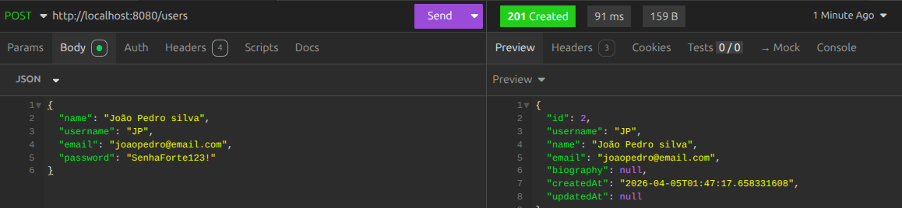

**Buscar Usuário por ID (GET `/users/{id}`)**
> Demonstração da busca de um usuário específico pelo seu ID.

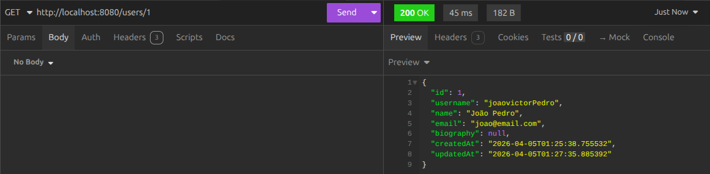

**Atualizar Usuário (PUT `/users/{id}`)**
> Demonstração da atualização dos dados de um usuário existente.

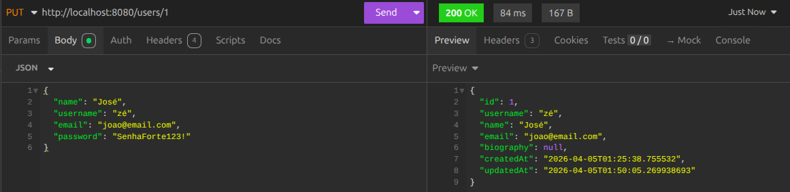

**Deletar Usuário (DELETE `/users/{id}`)**
> Demonstração da exclusão de um usuário do sistema.

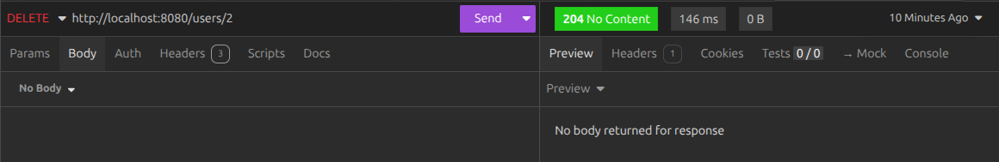

**Listar Posts de um Usuário (GET `/users/{id}/posts`)**
> Demonstração da listagem pública, retornando apenas posts que não estão arquivados do usuário.

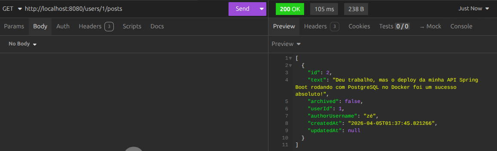

**Listar Comentários de um Usuário (GET `/users/{id}/comments`)**
> Demonstração da busca de todos os comentários feitos por um usuário específico.

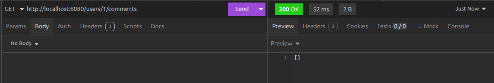

---

### 📝 2. Módulo de Publicações (Posts)

**Criação de Publicação (POST `/posts`)**
> Demonstração da criação de um post vinculado a um usuário.

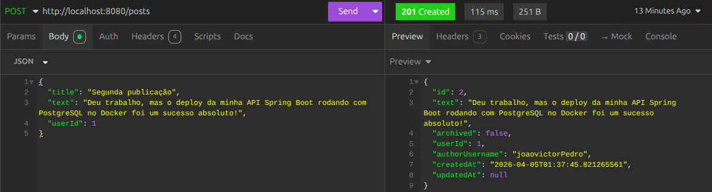

**Buscar Publicação por ID (GET `/posts/{id}`)**
> Demonstração da busca de uma publicação específica pelo seu ID.

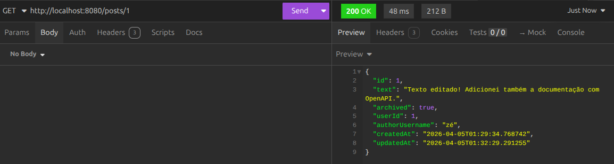

**Atualizar Publicação (PUT `/posts/{id}`)**
> Demonstração da edição do título e conteúdo de uma publicação.

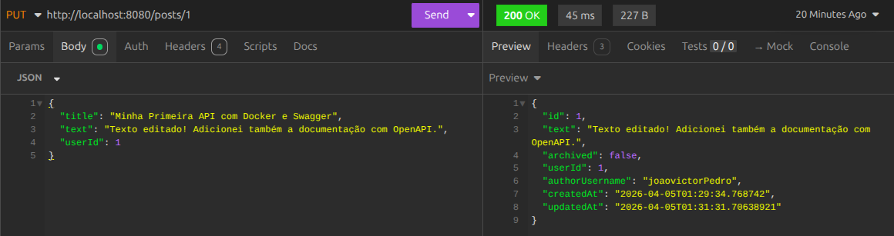

**Arquivar Publicação (PATCH `/posts/{id}/archive`)**
> Demonstração do arquivamento lógico de uma publicação.

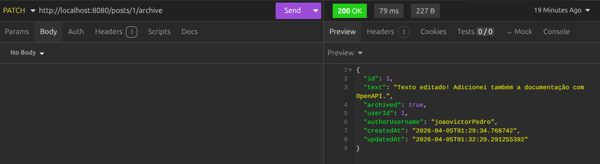

**Deletar Publicação (DELETE `/posts/{id}`)**
> Demonstração da exclusão de uma publicação do sistema.

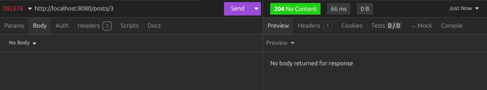

---

### 💬 3. Módulo de Comentários

**Criação de Comentário (POST `/comments`)**
> Demonstração de um usuário comentando em uma publicação.

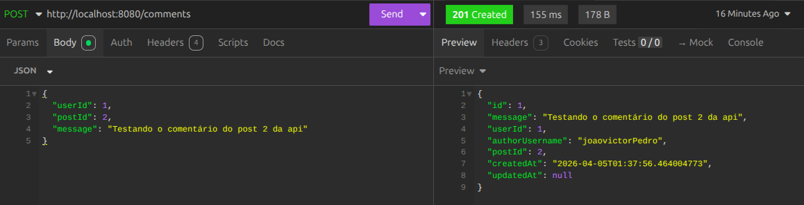

**Listar Comentários de uma Publicação (GET `/comments/post/{postId}`)**
> Demonstração da busca de todos os comentários vinculados a um Post específico.

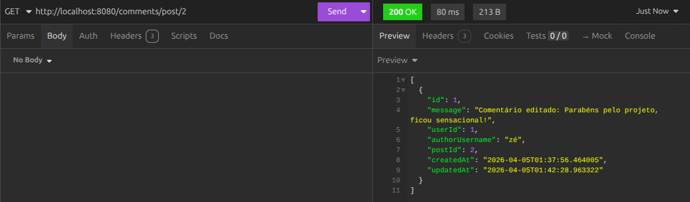

**Atualizar Comentário (PUT `/comments/{id}`)**
> Demonstração da edição do texto de um comentário existente.

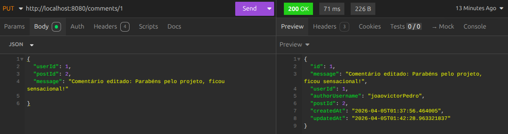

**Deletar Comentário (DELETE `/comments/{id}`)**
> Demonstração da exclusão de um comentário do sistema.

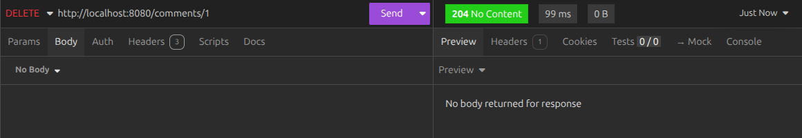

---
